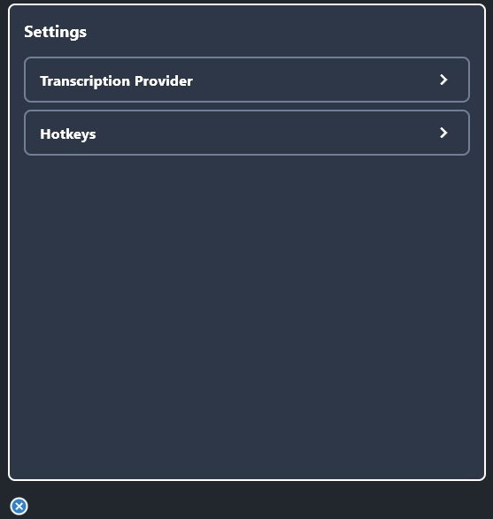
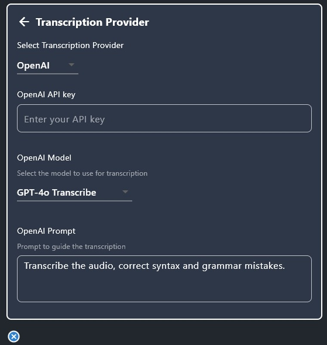

<div align="center">
  
  <h1>Open Vibrance</h1>
  <p>System-wide push-to-talk transcription overlay.<br/>Hold a hotkey, speak, release — text is transcribed and pasted into your active app.</p>

  
</div>

<br/>

## Quick Start

1. Download the latest release from [Releases](https://github.com/Altair200333/open_vibrance/releases)
2. Click the overlay dot to open settings — select a provider and enter your API key
3. Press `Alt+Q` to record, release to transcribe

> Bring your own key — the app is free, you provide an ElevenLabs or OpenAI API key.

## Providers

| Provider | Models |
|----------|--------|
| **ElevenLabs** | Scribe v1, v1 Experimental, v2, v2 Realtime (WebSocket streaming) |
| **OpenAI** | Whisper-1, GPT-4o Mini Transcribe, GPT-4o Transcribe |
| **Custom** | Any STT service via a Python script |

OpenAI providers support a custom prompt to guide transcription style and formatting.

## Features

- **Real-time streaming** — live transcription via ElevenLabs Scribe v2 Realtime
- **Stays out of your way** — always-on-top, click-through transparent dot with state animations
- **Auto paste** — transcribed text is copied to clipboard and pasted into the active window
- **Transcription history** — browse past transcriptions with audio playback and one-click retry
- **Configurable hotkey** — system-wide shortcut, default `Alt+Q`
- **7 themes** — Dark, Light, Aubergine, Dracula, Nord, Solarized, Choco Mint
- **Secure storage** — API keys stored in your OS keychain
- **Cross-platform** — Windows, macOS, Linux

## Screenshots

<details>
<summary>Settings and indicator states</summary>
<br/>


<br/><br/>


</details>

## Custom Provider

<details>
<summary>Use any STT service with a Python script</summary>
<br/>

Select **Custom** in provider settings. Your script receives audio as a base64 string in the global variable `base64_audio`. Print the transcript to stdout.

```python
import base64, requests

audio_bytes = base64.b64decode(base64_audio)

resp = requests.post(
    "https://api.elevenlabs.io/v1/speech-to-text",
    headers={"xi-api-key": "<YOUR_KEY>"},
    data={"model_id": "scribe_v1"},
    files={"file": ("audio.wav", audio_bytes, "audio/wav")},
)
resp.raise_for_status()
print(resp.json().get("text"))
```

Python must be accessible from your terminal (`python3` / `python` / `py`).
</details>

## Build from Source

```bash
git clone https://github.com/Altair200333/open_vibrance.git
git clone https://github.com/Altair200333/window_manager.git
cd open_vibrance
flutter pub get
flutter run -d windows  # or macos / linux
```

Requires the [Flutter SDK](https://flutter.dev/docs/get-started/install). The app depends on a [forked window_manager](https://github.com/Altair200333/window_manager) — clone it next to the project directory.
