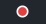

# Open Vibrance

> 

**Quick minimalistic transcription overlay**


## Table of Contents

- [About](#-about)
- [Download](#-download)
- [Why is it good?](#-why-is-it-good)
- [How to use](#-how-to-use)
  - [Option 1: Use ready API provider](#option-1-use-ready-api-provider)
  - [Option 2: Custom Python script](#option-2-custom-python-script-make-this-app-immortal)
- [Screenshots](#-screenshots)
- [How to build](#-how-to-build)

## 🚀 About


Open Vibrance is a simple desktop overlay that transcribes your speech. Hit a hotkey, speak, and your words are converted to text—copied to your clipboard and pasted directly into the app you're using.

Transcription Providers:
- *`Elevenlabs`* - Scribe-v1 models family
- *`OpenAI`* - Whisper/gpt-4o models with prompting
- *`Custom provider`* - write anything in Python 🐍

What can I use it for?

- 🎧 **Coding** – Dictate comments, ideas, or quick (or not quick) coding prompts.
- 🚀 **AI Prompting** – Craft your AI prompts quickly by speaking them out.
- 💬 **Messaging** – Send fast replies in your chat apps.
- 📝 **Note-taking** – Jot down thoughts without breaking your workflow.

## ⏬ Download

Head to [Releases page](https://github.com/Altair200333/open_vibrance/releases) and download __win_64.rar__ file, extract into any location, and run `open_vibrance.exe`

## 💫 Why is it good?
- 💰 **Kind of free xD:** The app itself is free. You use your own Elevenlabs/OpenAI API key
- 🎙️ **Easy Hotkey Control:** Start and stop recording with a single hotkey.
- 📋 **Automatic Paste & Clipboard:** Transcribed text is instantly pasted into your active app and also available on your clipboard.
- 📌 **Minimal UI:** A small, draggable overlay dot shows recording status and stays out of your way.
- 🌐 **Cross-platform (ideally):** Built with Flutter. 
  - Runs on Windows, macOS, and Linux (Tested only on 🪟 Windows 😅. Help with testing on macOS/Linux is welcome!).

## 🔊 How to use

### Option 1: Use ready API provider

1. Get OpenAI / Elevenlabs API key (make sure you have creadits!)
2. Click on blue indicator, in `Transcription Provider` section select your provider and paste API key
3. Hit *`Ctrl + Q`* (by default) and speak your text

### Option 2: Custom *Python* script (make this app immortal)

1. Click on blue indicator, in `Transcription Provider` select *Custom* option
2. Prepare Python script that will transcribe your speech (feel free to force LLM to do that xD)
    - Make sure Python is installed in your system and can be called from terminal using `python3` / `python` / `py`
    - Take audio data from global variable `base64_audio` (it will be pasted in runtime, don't worry), this will hold base64 encoded audio string
    - do whatever is required to transcribe that data
    - `print` it out to console, (i.e. `print(transcript)`), because the app will read stdout


#### Python Example with Elevenlabs:

```python
import base64
import requests

# Assumes `base64_audio` is defined globally and contains

audio_bytes = base64.b64decode(base64_audio)

API_KEY = "<API_KEY>" # TODO paste it here
URL     = 'https://api.elevenlabs.io/v1/speech-to-text'

data = {
    'model_id':               'scribe_v1',
    'num_speakers':           1,
    'tag_audio_events':       False,
    'timestamps_granularity': 'none',
}

files = {
    'file': ('audio.wav', audio_bytes, 'audio/wav'),
}

headers = {
    'xi-api-key': API_KEY,
}

resp = requests.post(URL, headers=headers, data=data, files=files)
resp.raise_for_status()
print(resp.json().get('text'))
```

## 🎨 Screenshots

### Menus:


### Indicator states:





## 🛠️ How to build
- **For developers:**
    1.  Make sure you have the [Flutter SDK](https://flutter.dev/docs/get-started/install) installed.
    2.  Clone this repository:
        ```bash
        git clone https://github.com/Altair200333/open_vibrance
        cd open-vibrance
        ```
    3.  Get dependencies:
        ```bash
        flutter pub get
        ```
    4.  Run the app (replace `windows` with `macos` or `linux`):
        ```bash
        flutter run -d windows
        ```