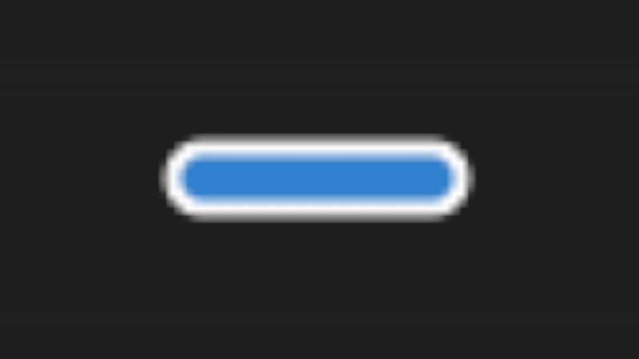

# Open Vibrance

**Quick minimalistic transcription overlay**




Open Vibrance is a simple desktop overlay that transcribes your speech. Hit a hotkey, speak, and your words are converted to text—copied to your clipboard and pasted directly into the app you're using.

Currently uses:
- *Elevenlabs* Scribe model
- _*TODO*_ - *OpenAI* Whisper support

## Ideal for
- 🎧 **Coding** – Dictate comments, ideas, or quick (or not quick) coding prompts.
- 🚀 **AI Prompting** – Craft your AI prompts quickly by speaking them out.
- 💬 **Messaging** – Send fast replies in your chat apps.
- 📝 **Note-taking** – Jot down thoughts without breaking your workflow.

## Main Features
- 💰 **Kind of free xD:** The app itself is free. You use your own Elevenlabs API key (Elevenlabs may charge for API usage/subscriptions).
- 🎙️ **Easy Hotkey Control:** Start and stop recording with a single hotkey.
- ⚡ **Accurate Transcription:** Powered by the Elevenlabs Scribe model.
- 📋 **Automatic Paste & Clipboard:** Transcribed text is instantly pasted into your active app and also available on your clipboard.
- 📌 **Minimal UI:** A small, draggable overlay dot shows recording status and stays out of your way.
- 🌐 **Cross-platform (mostly):** Built with Flutter. 
  - Runs on Windows, macOS, and Linux (at least, that's the goal! Tested on Windows 😅. Help with testing on macOS/Linux is welcome!).

## How to use
1.  **Get an Elevenlabs API Key:**
    *   Sign up at [Elevenlabs](https://elevenlabs.io/) (or your preferred provider if more are supported later).
    *   You'll likely need a subscription that includes API access for their Scribe model to get an API key.
2.  **Add API Key to Open Vibrance:** Click the overlay dot and paste your API key into the settings.
3.  **Record:** Press and hold the hotkey (`Alt+Q` by default) to start recording. Release the keys when you're done speaking.
4.  **Done!** Your transcription appears in your active app and is copied to your clipboard.

## How to set up (Building from source)
- **For developers:**
    1.  Make sure you have the [Flutter SDK](https://flutter.dev/docs/get-started/install) installed.
    2.  Clone this repository:
        ```bash
        git clone https://github.com/Altair200333/open_vibrance
        cd open-vibrance
        ```
    3.  Get dependencies:
        ```bash
        flutter pub get
        ```
    4.  Run the app (replace `windows` with `macos` or `linux`):
        ```bash
        flutter run -d windows
        ```